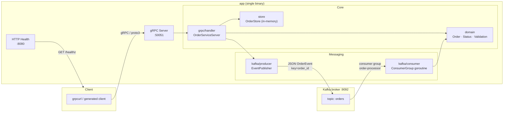

# GoGrpcKafkaMicroservice

A portfolio-quality Go microservice demonstrating synchronous gRPC and asynchronous Kafka event publishing in a single binary.

[](https://go.dev/dl/)
[](LICENSE)
[](https://github.com/vlantonov/GoGrpcKafkaMicroservice/actions/workflows/ci.yml)

---

## Architecture



**CreateOrder data flow:**

1. Client calls `CreateOrder` over gRPC.
2. `grpc/handler` validates the request, writes to the in-memory store, publishes an `OrderEvent` via `kafka/producer` (fire-and-forget), and returns the created `Order`.
3. The `kafka/consumer` goroutine reads the event off the topic and logs it at INFO level.

---

## Prerequisites

| Tool | Minimum version |
|------|----------------|
| Go | 1.22 |
| Docker + Compose v2 | 20.10 / 2.20 |
| `protoc` + plugins | optional (generated stubs are committed) |

---

## Quick Start

```bash
# Clone and start the full local stack
git clone https://github.com/vlantonov/GoGrpcKafkaMicroservice.git
cd GoGrpcKafkaMicroservice
docker compose up --build
```

Wait for the `app` service to print `gRPC server listening`. Then in a second terminal:

```bash
# Create an order
grpcurl -plaintext -d '{"item":"Widget","quantity":3}' \
  localhost:50051 orders.v1.OrderService/CreateOrder

# Get the order (replace <id> with the UUID returned above)
grpcurl -plaintext -d '{"id":"<id>"}' \
  localhost:50051 orders.v1.OrderService/GetOrder

# List all orders
grpcurl -plaintext -d '{}' \
  localhost:50051 orders.v1.OrderService/ListOrders

# Update the order status
grpcurl -plaintext -d '{"id":"<id>","new_status":"STATUS_CONFIRMED"}' \
  localhost:50051 orders.v1.OrderService/UpdateOrderStatus
```

Browse the Kafka UI at **http://localhost:8090** to inspect messages on the `orders` topic.

---

## gRPC API Reference

**Service:** `orders.v1.OrderService` on port `50051`

### RPCs

| RPC | Description |
|-----|-------------|
| `CreateOrder` | Validates and persists a new order; publishes `order.created` event |
| `GetOrder` | Returns a single order by UUID; `NOT_FOUND` if absent |
| `ListOrders` | Returns all orders; supports an optional `status_filter` |
| `UpdateOrderStatus` | Transitions an order's status; enforces legal transitions |

### Request / Response Fields

#### `CreateOrderRequest`

| Field | Type | Required | Notes |
|-------|------|----------|-------|
| `item` | string | yes | Human-readable description, 1–200 chars |
| `quantity` | uint32 | yes | Minimum 1 |

#### `CreateOrderResponse`

| Field | Type | Notes |
|-------|------|-------|
| `order` | `Order` | The created order with a generated UUID `id` |

#### `GetOrderRequest`

| Field | Type | Notes |
|-------|------|-------|
| `id` | string | UUID v4 of the order |

#### `GetOrderResponse`

| Field | Type | Notes |
|-------|------|-------|
| `order` | `Order` | The matching order |

#### `ListOrdersRequest`

| Field | Type | Notes |
|-------|------|-------|
| `status_filter` | `Status` | Optional; `STATUS_UNSPECIFIED` (0) returns all orders |

#### `ListOrdersResponse`

| Field | Type | Notes |
|-------|------|-------|
| `orders` | repeated `Order` | Matching orders |

#### `UpdateOrderStatusRequest`

| Field | Type | Notes |
|-------|------|-------|
| `id` | string | UUID v4 of the order |
| `new_status` | `Status` | Target status |

#### `UpdateOrderStatusResponse`

| Field | Type | Notes |
|-------|------|-------|
| `order` | `Order` | The updated order |

#### `Order` message

| Field | Type | Notes |
|-------|------|-------|
| `id` | string | UUID v4, assigned by the service |
| `item` | string | Item description |
| `quantity` | uint32 | Quantity |
| `status` | `Status` | Current status |
| `created_at` | int64 | Unix epoch seconds |

#### `Status` enum

| Value | Number | Meaning |
|-------|--------|---------|
| `STATUS_UNSPECIFIED` | 0 | Default / no filter |
| `STATUS_PENDING` | 1 | Newly created |
| `STATUS_CONFIRMED` | 2 | Confirmed |
| `STATUS_CANCELLED` | 3 | Cancelled |

#### Legal status transitions

```
PENDING → CONFIRMED
PENDING → CANCELLED
CONFIRMED → CANCELLED
```

Any other transition returns gRPC `INVALID_ARGUMENT`.

---

## Kafka Events

**Topic:** `orders`  
**Message key:** `order_id` (UTF-8 — ensures all events for one order land on the same partition)  
**Message value:** UTF-8 JSON

```json
{
  "event_type": "order.created",
  "order_id":   "550e8400-e29b-41d4-a716-446655440000",
  "status":     "PENDING",
  "timestamp":  1724793600
}
```

| Field | Type | Values |
|-------|------|--------|
| `event_type` | string | `order.created` \| `order.status_updated` |
| `order_id` | string | UUID v4 |
| `status` | string | `PENDING` \| `CONFIRMED` \| `CANCELLED` |
| `timestamp` | int64 | Unix epoch seconds |

Events are emitted after `CreateOrder` (`order.created`) and `UpdateOrderStatus` (`order.status_updated`). Kafka publish failures are logged but do not fail the gRPC response.

---

## Configuration

All parameters are read from environment variables. The values below are the defaults applied when the variable is unset.

| Variable | Default | Description |
|----------|---------|-------------|
| `GRPC_PORT` | `50051` | TCP port the gRPC server listens on |
| `KAFKA_BROKERS` | `localhost:9092` | Comma-separated list of `host:port` broker addresses |
| `KAFKA_TOPIC` | `orders` | Kafka topic for order events |
| `KAFKA_GROUP_ID` | `order-processor` | Consumer group ID |
| `LOG_LEVEL` | `info` | Logging verbosity: `info` or `debug` |
| `HEALTH_PORT` | `8080` | TCP port for the HTTP `/healthz` endpoint |

Override any variable via `docker compose` environment or a `.env` file:

```bash
GRPC_PORT=9090 KAFKA_BROKERS=broker1:9092,broker2:9092 docker compose up
```

---

## Development

### Makefile targets

```bash
make help         # list all targets with descriptions
make proto        # regenerate Go stubs from proto/orders/v1/orders.proto
make build        # go build ./... → bin/server
make test         # go test -race -cover ./...
make lint         # golangci-lint run
make docker-up    # docker compose up --build -d
make docker-down  # docker compose down
```

### Build locally

```bash
make build
# binary at bin/server
./bin/server
```

### Run tests with coverage

```bash
make test
# or directly:
go test -race -coverprofile=coverage.out ./...
go tool cover -html=coverage.out
```

### Lint

```bash
make lint
# requires golangci-lint in PATH; install via:
# go install github.com/golangci/golangci-lint/cmd/golangci-lint@latest
```

### Regenerate protobuf stubs

```bash
make proto
# requires: protoc, protoc-gen-go, protoc-gen-go-grpc
# Generated stubs are committed to gen/ so this step is optional for building.
```

### Health check

```bash
curl http://localhost:8080/healthz
# {"status":"ok"}
```

---

## Project Structure

```
GoGrpcKafkaMicroservice/
│
├── cmd/server/main.go          # Entry point: config, dependency wiring, graceful shutdown
│
├── internal/
│   ├── config/config.go        # env-var → Config struct
│   ├── domain/
│   │   ├── order.go            # Order struct, Status constants, NewOrder constructor
│   │   ├── event.go            # OrderEvent struct (Kafka payload)
│   │   └── validation.go       # ValidateCreate, ValidateTransition (state-machine)
│   ├── store/store.go          # Thread-safe in-memory OrderStore (sync.RWMutex)
│   ├── grpc/handler/handler.go # OrderServiceServer: wires store + publisher
│   ├── health/health.go        # HTTP /healthz endpoint on HEALTH_PORT
│   └── kafka/
│       ├── producer/producer.go # SaramaProducer: JSON → Kafka sync-producer
│       └── consumer/consumer.go # SaramaConsumer: consumer-group goroutine
│
├── proto/orders/v1/orders.proto # Proto3 service definition (source of truth)
├── gen/orders/v1/              # Generated Go stubs — do not edit
│
├── Dockerfile                  # Multi-stage: golang:1.22-alpine → distroless final
├── docker-compose.yml          # zookeeper, kafka, kafka-init, kafka-ui, app
├── Makefile                    # Developer workflow targets
└── .golangci.yml               # Linter configuration
```

---

## Docker Compose Services

| Service | Image | Host port | Purpose |
|---------|-------|-----------|---------|
| `zookeeper` | `confluentinc/cp-zookeeper:7.6` | `2181` | Kafka coordination |
| `kafka` | `confluentinc/cp-kafka:7.6` | `9092` | Kafka broker |
| `kafka-init` | `confluentinc/cp-kafka:7.6` | — | One-shot topic creation (`orders`) |
| `kafka-ui` | `provectuslabs/kafka-ui:latest` | `8090` | Browser-based topic inspection |
| `app` | Local `Dockerfile` | `50051`, `8080` | The Go microservice |

---

## License

[MIT](LICENSE)
