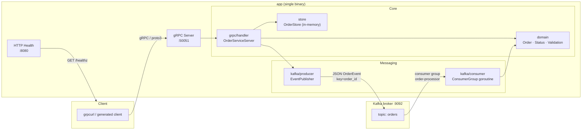
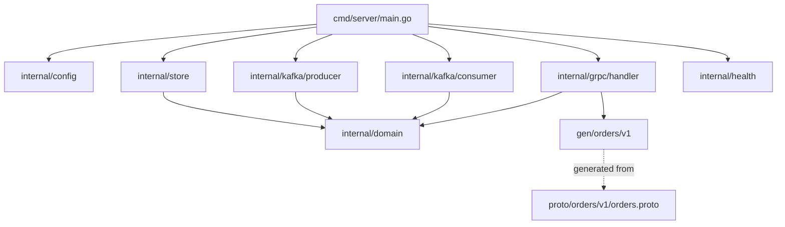

# Design Document — GoGrpcKafkaMicroservice

**Project:** GoGrpcKafkaMicroservice  
**Version:** 1.0.0  
**Date:** 2026-08-28  
**Status:** Ready for implementation  
**SRS ref:** `docs/requirements/SRS.md` v1.0.0

---

## 1. Architecture Overview

The binary runs three concurrent subsystems that are wired together in `cmd/server/main.go` and shut down cooperatively via a shared `context.Context`.



**Data flow (CreateOrder):**

1. Client calls `CreateOrder` over gRPC.
2. `grpc/handler` validates the request via `domain`, writes to `store`, publishes an `OrderEvent` via `kafka/producer` (fire-and-forget — failure only logged), and returns the created `Order`.
3. The `kafka/consumer` goroutine reads the event off the topic and logs it at INFO level.

**Graceful shutdown sequence (SIGINT/SIGTERM):**

1. Root context cancelled → `GracefulStop` on gRPC server (10 s drain).
2. Kafka consumer group session closed, offsets committed.
3. Kafka sync-producer flushed and closed.
4. HTTP server shut down.
5. Process exits with code 0.

---

## 2. Module / Directory Layout

**Module path:** `github.com/vlantonov/GoGrpcKafkaMicroservice`  
**Go minimum version:** `1.22`

```
GoGrpcKafkaMicroservice/
│
├── cmd/
│   └── server/
│       └── main.go          # Entry point: parse config, build deps, start servers, handle shutdown
│
├── internal/
│   ├── config/
│   │   └── config.go        # Read env vars → Config struct; validate required fields
│   │
│   ├── domain/
│   │   ├── order.go         # Order struct, Status enum (constants), NewOrder constructor
│   │   └── validation.go    # ValidateCreate, ValidateTransition (state-machine logic)
│   │
│   ├── store/
│   │   ├── store.go         # MemoryStore: implements OrderStore interface with sync.RWMutex
│   │   └── store_test.go    # Unit tests for all CRUD paths + concurrency
│   │
│   ├── kafka/
│   │   ├── producer/
│   │   │   ├── producer.go       # SaramaProducer: wraps sarama.SyncProducer, implements EventPublisher
│   │   │   └── producer_test.go  # Unit tests with sarama mock
│   │   └── consumer/
│   │       ├── consumer.go       # SaramaConsumer: wraps sarama.ConsumerGroup, implements EventConsumer
│   │       └── consumer_test.go  # Unit tests with sarama mock consumer
│   │
│   ├── grpc/
│   │   └── handler/
│   │       ├── handler.go        # OrderServiceServer: depends on OrderStore + EventPublisher interfaces
│   │       └── handler_test.go   # Unit tests; inject fakes for store + publisher
│   │
│   └── health/
│       └── health.go        # HTTP mux; /healthz returns {"status":"ok"} once ready
│
├── proto/
│   └── orders/
│       └── v1/
│           └── orders.proto # Proto3 service definition (source of truth)
│
├── gen/
│   └── orders/
│       └── v1/
│           ├── orders.pb.go       # Generated — do not edit
│           └── orders_grpc.pb.go  # Generated — do not edit
│
├── Makefile
├── Dockerfile
├── docker-compose.yml
├── .golangci.yml
└── go.mod
```

> **`internal/` boundary:** All packages under `internal/` are invisible to external importers. The only public surface for downstream consumers (if any) would live under a `pkg/` subtree — not needed for this project.

---

## 3. Key Interfaces

Interfaces are defined in the packages that **consume** them (consumer-defined interfaces), keeping dependencies pointing inward.

### 3.1 `OrderStore` — defined in `internal/grpc/handler`

```go
// OrderStore is the persistence abstraction required by the gRPC handler.
type OrderStore interface {
    Create(ctx context.Context, order *domain.Order) error
    Get(ctx context.Context, id string) (*domain.Order, error)
    List(ctx context.Context, filter domain.Status) ([]*domain.Order, error)
    UpdateStatus(ctx context.Context, id string, newStatus domain.Status) (*domain.Order, error)
}
```

> `domain.Status` is the zero value `StatusUnspecified`; `List` with `StatusUnspecified` returns all orders.  
> `Get` and `UpdateStatus` return `ErrNotFound` (a sentinel in `internal/store`) when the ID is absent.

### 3.2 `EventPublisher` — defined in `internal/grpc/handler`

```go
// EventPublisher is the messaging abstraction required by the gRPC handler.
type EventPublisher interface {
    Publish(ctx context.Context, event *domain.OrderEvent) error
    Close() error
}
```

> `Publish` is called asynchronously from the handler — the caller logs and discards the error (FR-09).

### 3.3 `EventConsumer` — defined in `cmd/server`

```go
// EventConsumer is the background consumer managed by the process lifecycle.
type EventConsumer interface {
    Start(ctx context.Context) error
    Close() error
}
```

> `Start` blocks until the provided context is cancelled. It is launched in its own goroutine.

---

### 3.4 Sentinel Errors (`internal/store`)

```go
var (
    ErrNotFound      = errors.New("order not found")
    ErrInvalidStatus = errors.New("invalid status transition")
)
```

The gRPC handler maps these to `codes.NotFound` and `codes.InvalidArgument` respectively (FR-04, FR-05).

---

## 4. Protobuf Contract

**File:** `proto/orders/v1/orders.proto`

```proto
syntax = "proto3";

package orders.v1;

option go_package = "github.com/vlantonov/GoGrpcKafkaMicroservice/gen/orders/v1;ordersv1";

// ── Enums ──────────────────────────────────────────────────────────────────

enum Status {
  STATUS_UNSPECIFIED = 0;
  STATUS_PENDING     = 1;
  STATUS_CONFIRMED   = 2;
  STATUS_CANCELLED   = 3;
}

// ── Domain message ─────────────────────────────────────────────────────────

message Order {
  string id         = 1; // UUID v4
  string item       = 2;
  uint32 quantity   = 3;
  Status status     = 4;
  int64  created_at = 5; // Unix epoch seconds
}

// ── RPC messages ───────────────────────────────────────────────────────────

message CreateOrderRequest {
  string item     = 1;
  uint32 quantity = 2;
}
message CreateOrderResponse {
  Order order = 1;
}

message GetOrderRequest {
  string id = 1;
}
message GetOrderResponse {
  Order order = 1;
}

message ListOrdersRequest {
  // Zero value (STATUS_UNSPECIFIED) means return all orders.
  Status status_filter = 1;
}
message ListOrdersResponse {
  repeated Order orders = 1;
}

message UpdateOrderStatusRequest {
  string id         = 1;
  Status new_status = 2;
}
message UpdateOrderStatusResponse {
  Order order = 1;
}

// ── Service ────────────────────────────────────────────────────────────────

service OrderService {
  rpc CreateOrder       (CreateOrderRequest)       returns (CreateOrderResponse);
  rpc GetOrder          (GetOrderRequest)           returns (GetOrderResponse);
  rpc ListOrders        (ListOrdersRequest)         returns (ListOrdersResponse);
  rpc UpdateOrderStatus (UpdateOrderStatusRequest)  returns (UpdateOrderStatusResponse);
}
```

**Regeneration command** (captured in `Makefile proto` target):

```bash
protoc \
  --go_out=gen --go_opt=paths=source_relative \
  --go-grpc_out=gen --go-grpc_opt=paths=source_relative \
  proto/orders/v1/orders.proto
```

Generated files are committed to `gen/` (NFR-02) so consumers do not need `protoc` installed to build.

---

## 5. Kafka Event Schema

**Topic:** `orders`  
**Message key:** `order_id` (UTF-8 string — ensures all events for one order land on the same partition)  
**Message value:** UTF-8 JSON

```json
{
  "event_type": "order.created",
  "order_id":   "550e8400-e29b-41d4-a716-446655440000",
  "status":     "PENDING",
  "timestamp":  1724793600
}
```

| Field        | Type   | Values                                    |
|--------------|--------|-------------------------------------------|
| `event_type` | string | `order.created` \| `order.status_updated` |
| `order_id`   | string | UUID v4                                   |
| `status`     | string | `PENDING` \| `CONFIRMED` \| `CANCELLED`   |
| `timestamp`  | int64  | Unix epoch seconds                        |

**Go struct** (`internal/domain/event.go`):

```go
type OrderEvent struct {
    EventType string `json:"event_type"`
    OrderID   string `json:"order_id"`
    Status    string `json:"status"`
    Timestamp int64  `json:"timestamp"`
}
```

Serialised with `encoding/json` — no external codec required (schema registry is out of scope per Section 6 of the SRS).

---

## 6. Configuration

All values read in `internal/config/config.go` via `os.Getenv` with documented defaults.

| Environment Variable | Default           | Description                                   |
|----------------------|-------------------|-----------------------------------------------|
| `GRPC_PORT`          | `50051`           | TCP port the gRPC server listens on           |
| `KAFKA_BROKERS`      | `localhost:9092`  | Comma-separated list of broker `host:port`    |
| `KAFKA_TOPIC`        | `orders`          | Kafka topic for order events                  |
| `KAFKA_GROUP_ID`     | `order-processor` | Consumer group ID                             |
| `LOG_LEVEL`          | `info`            | `info` or `debug` (maps to `slog.Level`)      |
| `HEALTH_PORT`        | `8080`            | TCP port for the HTTP `/healthz` endpoint     |

```go
type Config struct {
    GRPCPort     string
    KafkaBrokers []string // split on ","
    KafkaTopic   string
    KafkaGroupID string
    LogLevel     slog.Level
    HealthPort   string
}
```

> **Missing-requirement flag:** The SRS does not specify a `HEALTH_PORT` variable — it hard-codes port `8080`. The design adds `HEALTH_PORT` for parity with `GRPC_PORT` configurability. If the reviewer prefers the hard-coded value, this variable can be dropped without any architectural change.

---

## 7. Docker Compose Services

**File:** `docker-compose.yml`

| Service       | Image                            | Host port(s)   | Depends on                  | Health-check                                                 |
|---------------|----------------------------------|----------------|-----------------------------|--------------------------------------------------------------|
| `zookeeper`   | `confluentinc/cp-zookeeper:7.6`  | `2181`         | —                           | TCP connect to `2181`                                        |
| `kafka`       | `confluentinc/cp-kafka:7.6`      | `9092`         | `zookeeper` healthy         | `kafka-broker-api-versions --bootstrap-server localhost:9092` |
| `kafka-init`  | `confluentinc/cp-kafka:7.6`      | none           | `kafka` healthy             | One-shot: `kafka-topics --create --topic orders …` then exit |
| `kafka-ui`    | `provectuslabs/kafka-ui:latest`  | `8090`         | `kafka` healthy             | HTTP GET `http://localhost:8080/actuator/health`             |
| `app`         | Built from local `Dockerfile`    | `50051`, `8080`| `kafka-init` (service_completed_successfully) | HTTP GET `http://localhost:8080/healthz` |

**Notes:**

- `kafka-init` is a one-shot `command:` container that creates the `orders` topic using `kafka-topics.sh --if-not-exists`, satisfying DC-04. Using a dedicated init container is preferred over `KAFKA_CREATE_TOPICS` (that env var is unofficial and unreliable in CP images).
- `app` uses `depends_on: kafka-init: condition: service_completed_successfully` to guarantee the topic exists before the producer fires.
- No persistent volumes — dev-only (DC-06).
- All services share a user-defined bridge network `app-net` (DC-05).

---

## 8. Technology Choices

| Library | Version | License | Justification |
|---|---|---|---|
| `google.golang.org/grpc` | `v1.65.0` | Apache-2.0 | Official Go gRPC runtime; required by NFR-03. |
| `google.golang.org/protobuf` | `v1.34.2` | BSD-3-Clause | Official Protobuf v2 API for Go; required by NFR-03. |
| `github.com/IBM/sarama` | `v1.43.3` | MIT | Maintained successor to the deprecated `github.com/Shopify/sarama`. Pure Go — no CGo, unlike `confluent-kafka-go`. Consumer-group API maps directly to FR-10–FR-13. Ships a `sarama/mocks` sub-package used in unit tests. |
| `log/slog` (stdlib) | Go 1.21+ | — | Structured JSON logging at zero import cost; satisfies FR-17 and NFR-03 (no extra logger dependency). |
| `github.com/google/uuid` | `v1.6.0` | BSD-3-Clause | Cryptographically random UUID v4 generation; required by NFR-03. |
| `github.com/stretchr/testify` | `v1.9.0` | MIT | `assert` and `require` packages for readable test assertions; required by NFR-03. |

**Rejected alternatives:**

- `go.uber.org/zap` — powerful but adds a dependency; `slog` is sufficient for the logging requirements and is in stdlib since Go 1.21.
- `github.com/confluentinc/confluent-kafka-go` — requires `librdkafka` CGo binding, complicates the multi-stage `Dockerfile` and cross-compilation.
- `github.com/segmentio/kafka-go` — simpler API but lacks a built-in mock package; sarama mocks make unit tests easier.

---

## 9. Key Design Decisions & Trade-offs

| Decision | Chosen approach | Alternative considered | Reason |
|---|---|---|---|
| **Kafka client** | `github.com/IBM/sarama` | `segmentio/kafka-go`, `confluent-kafka-go` | Built-in mock package; pure Go; MIT license. |
| **Logger** | `log/slog` | `go.uber.org/zap` | Zero extra dependency; satisfies FR-17. |
| **Interface ownership** | Consumer-defined (handler owns `OrderStore`, `EventPublisher`) | Provider-defined in `store/` and `kafka/` | Avoids coupling internal packages; enables fake injection in tests without import cycles. |
| **Async publish** | Goroutine-per-call fire-and-forget, error logged | Channel-based outbox | SRS FR-09 explicitly requires this; an outbox would add scope beyond SRS. |
| **Config loading** | Plain `os.Getenv` + `Config` struct | `github.com/spf13/viper`, `github.com/caarlos0/env` | No extra dependency; config is simple enough. |
| **Protobuf gen output** | Committed under `gen/` | Generated at build time | NFR-02 mandates committed stubs; simplifies `go build` without `protoc`. |
| **State-transition logic placement** | `internal/domain/validation.go` | Inside the store | Domain logic belongs in the domain layer; keeps the store a dumb map. |

---

## 10. Testing Strategy

### 10.1 Unit Tests (target: ≥ 80 % statement coverage on business-logic packages)

| Package | What to test | Mocking approach |
|---|---|---|
| `internal/domain` | `ValidateCreate` (item empty, quantity 0), `ValidateTransition` (all legal + all illegal paths) | No mocks needed — pure functions |
| `internal/store` | `Create`, `Get` (found / not found), `List` (all / filtered), `UpdateStatus` (happy + `ErrNotFound` + `ErrInvalidStatus`), concurrent writes | No mocks — exercise the real `MemoryStore`; run with `-race` |
| `internal/grpc/handler` | All four RPCs: happy paths + validation errors + store errors → correct gRPC status codes | Hand-written `fakeStore` and `fakePublisher` implementing the handler's interfaces |
| `internal/kafka/producer` | `Publish` encodes JSON correctly, uses order ID as key, propagates sarama error | `sarama/mocks.SyncProducer` |
| `internal/kafka/consumer` | Handler receives message, logs it, commits offset; context cancellation stops the loop | `sarama/mocks.ConsumerGroup` |
| `internal/config` | All defaults applied; `KAFKA_BROKERS` split on comma; invalid `LOG_LEVEL` handled | No mocks — set env vars in test |
| `internal/health` | `/healthz` returns 200 + JSON body | `net/http/httptest` |

### 10.2 Integration Tests (optional, not counted toward 80 % threshold)

Run against a real Kafka broker started via `docker compose up kafka` (or a `TestMain` that brings up a `testcontainers-go` Kafka container).

Scenarios:
- Publish an event → consumer receives it within 5 s.
- Restart consumer with committed offset → no duplicate processing.

### 10.3 Race Detection

`go test -race ./...` shall be part of both local `make test` and any CI run. All `internal/store` tests must pass under the race detector.

### 10.4 Fake vs. Mock

Prefer **hand-written fakes** (simple structs that implement the consumer-defined interface with in-memory state) for `OrderStore` and `EventPublisher` in handler tests. Use **`sarama/mocks`** only in the kafka sub-packages where the sarama API surface is large. Avoid `testify/mock` code generation to keep the test code readable.

---

## 11. Risks & Open Questions

| # | Risk | Mitigation |
|---|---|---|
| R-01 | `confluentinc/cp-kafka:7.6` is EOL; `cp-kafka:7.9` is the current LTS | Acceptable for a portfolio project; pinned version ensures reproducibility |
| R-02 | `sarama.SyncProducer` blocks until the broker ACKs; under broker failure, `Publish` could block a gRPC handler goroutine | Wrap `Publish` call with a short `context`-derived timeout (e.g., 2 s); discard the error as per FR-09 |
| R-03 | `HEALTH_PORT` is a design addition not present in the SRS | Flag back to Requirements Analyst: add `HEALTH_PORT` to FR-16 or confirm the hard-coded `8080` is acceptable |
| R-04 | `kafka-init` one-shot container relies on `service_completed_successfully` condition (Compose ≥ 2.20) | Document minimum Docker Compose version in README |

---

## Appendix A — `go.mod` skeleton

```
module github.com/vlantonov/GoGrpcKafkaMicroservice

go 1.22

require (
    github.com/IBM/sarama              v1.43.3
    github.com/google/uuid             v1.6.0
    github.com/stretchr/testify        v1.9.0
    google.golang.org/grpc             v1.65.0
    google.golang.org/protobuf         v1.34.2
)
```

---

## Appendix B — Package Dependency Graph



Arrows point in the direction of the import. `domain` has **no imports** within the project (no import cycles possible). `gen` is imported only by `handler` and `main`.

---

*Design Document prepared by System Architect agent — 2026-08-28*
